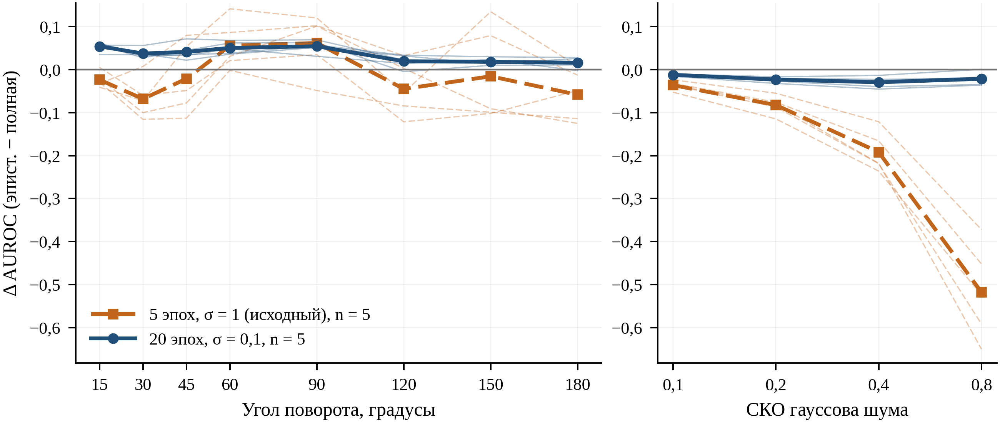
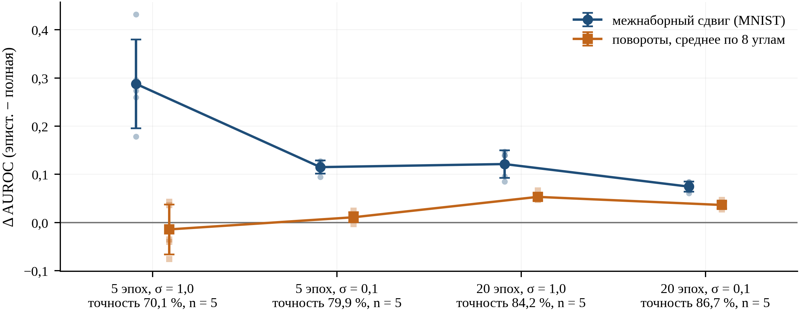

# Декомпозиция предсказательной неопределённости байесовской свёрточной сети для обнаружения данных вне обучающего распределения

Код и результаты к статье

> И.А. Кистин, Ш.М. Исаев. Декомпозиция предсказательной неопределённости байесовской
> свёрточной сети для обнаружения данных вне обучающего распределения // Научно-технический
> вестник информационных технологий, механики и оптики (рукопись находится на рассмотрении
> в редакции; выходные данные будут добавлены после публикации).

Репозиторий содержит всё, что нужно для воспроизведения численных результатов и рисунков
статьи: реализацию байесовской свёрточной сети, скрипты всех экспериментов, сохранённые
метрики и сырые оценки неопределённости, а также скрипты, строящие таблицы и рисунки статьи
из этих файлов.

---

## Быстрый старт

```bash
python -m pip install -r requirements.txt --extra-index-url https://download.pytorch.org/whl/cpu
cd src

python tables.py      # печатает таблицы 2–5 и П1–П4 (П4 — данные рис. 4)
python figures.py     # строит рис. 1–4 в figures/
```

Каталог `results/` уже содержит результаты, на которых построена статья, поэтому `tables.py`
и `figures.py` работают сразу, без повторного обучения. Наборы данных загружаются
автоматически в `src/data/`. Расчёт выполнялся на CPU, GPU не требуется.

Повторное обучение:

```bash
python core.py --seeds 0 1 2 3 4    # эксперимент A — FashionMNIST → MNIST, полные наборы
python audit_runs.py                # повороты в двух режимах, MC-вариабельность,
                                    #   проверка побитовой воспроизводимости results/*.json
python regime_rotations.py          # промежуточные режимы обучения (эксперимент C)
python shift_types.py               # отложенные классы, KMNIST, гауссов шум (эксперимент B)
```

---

## Что и как считается

Байесовская свёрточная сеть обучается стохастическим вариационным выводом со средним полем.
Предсказательное распределение оценивается по `S = 50` выборкам из вариационного
апостериорного распределения весов, после чего полная предсказательная энтропия
раскладывается на две составляющие:

```
H[p̂(y|x*)]  =  (1/S) Σ_s H[softmax(f(x*; w_s))]  +  I(y; w | x*, D)
   полная            алеаторная (U_alea)              эпистемическая (U_epi)
```

Все энтропии — в натах. Сравниваются четыре меры: максимум softmax, полная энтропия,
алеаторная и эпистемическая составляющие. Качество обнаружения — AUROC (внешнее
распределение — положительный класс) и FPR@95TPR; обе метрики не зависят от порога.
Разности AUROC между мерами оцениваются парным бутстрепом на одних и тех же объектах.

---

## Эксперименты

| Эксперимент | Внешнее распределение | Режимы обучения | Сиды | Объекты (внутр. / внешн.) |
|---|---|---|---|---|
| A | MNIST, тест | исходный | 0–4 | 10 000 / 10 000 |
| B | MNIST, KMNIST | исходный, лучше обученный | 0–4 | 4000 / 4000 |
| B | классы «рубашка» и «кроссовок», исключённые из обучения | исходный, лучше обученный | 0–4 | 8000 / 2000 |
| B | повороты тех же объектов на 15–180° | исходный, лучше обученный | 0–4 | 4000 / 4000 × 8 |
| B | гауссов шум на тех же объектах, СКО 0,1–0,8 | исходный, лучше обученный | 0–4 | 4000 / 4000 × 4 |
| C | MNIST и повороты | четыре режима | 0–4 | 4000 / 4000 |

Режимы обучения: исходный — 5 эпох, априорное распределение N(0, I); лучше обученный —
20 эпох, N(0, 0,01·I); промежуточные — 5 эпох и σ = 0,1; 20 эпох и σ = 1.

---

## Основные результаты

Все числа ниже получены из файлов `results/` скриптом `src/tables.py`; среднее ± СКО по пяти сидам, если не указано иное.

**Эксперимент A — FashionMNIST → MNIST, полные тестовые наборы (10 000 / 10 000), исходный режим обучения.**

| Мера | AUROC | 95 % ДИ | FPR@95TPR |
|---|---|---|---|
| Эпистемическая составляющая | 0,948 ± 0,014 | [0,931; 0,966] | 0,294 ± 0,093 |
| Полная энтропия | 0,663 ± 0,085 | [0,557; 0,769] | 0,675 ± 0,083 |
| Максимум softmax | 0,625 ± 0,058 | [0,553; 0,697] | 0,688 ± 0,068 |
| Алеаторная составляющая | 0,480 ± 0,084 | [0,376; 0,584] | 0,741 ± 0,091 |

Разность AUROC «эпистемическая − полная» положительна во всех пяти запусках (от 0,186 до 0,412), 95 % ДИ парного бутстрепа ни в одном запуске не содержит нуля.

**Эксперимент B — пять видов сдвига в двух режимах обучения.** Исходный режим — 5 эпох, априорное распределение N(0, I); лучше обученный — 20 эпох, N(0, 0,01·I). Межнаборные и ковариатные сдвиги — подвыборки 4000 / 4000 объектов, отложенные классы — 8000 / 2000.

| Сдвиг | Режим | AUROC эпист. | AUROC полная | Δ (эпист. − полная) | +/−/n |
|---|---|---|---|---|---|
| Межнаборный: MNIST | исходный | 0,953 | 0,665 | +0,288 ± 0,092 | 5/0/5 |
| Межнаборный: MNIST | лучше обученный | 0,984 | 0,910 | +0,075 ± 0,010 | 5/0/5 |
| Межнаборный: KMNIST | исходный | 0,936 | 0,717 | +0,219 ± 0,076 | 5/0/5 |
| Межнаборный: KMNIST | лучше обученный | 0,984 | 0,913 | +0,072 ± 0,010 | 5/0/5 |
| Близкий: отложенные классы «рубашка», «кроссовок» | исходный | 0,610 | 0,575 | +0,035 ± 0,017 | 5/0/5 |
| Близкий: отложенные классы «рубашка», «кроссовок» | лучше обученный | 0,736 | 0,701 | +0,034 ± 0,006 | 5/0/5 |
| Ковариатный: поворот 15–180° | исходный | 0,736 | 0,750 | −0,014 ± 0,052 | 13/21/40 |
| Ковариатный: поворот 15–180° | лучше обученный | 0,884 | 0,848 | +0,036 ± 0,007 | 38/1/40 |
| Ковариатный: гауссов шум, СКО 0,1–0,8 | исходный | 0,474 | 0,681 | −0,207 ± 0,044 | 0/20/20 |
| Ковариатный: гауссов шум, СКО 0,1–0,8 | лучше обученный | 0,651 | 0,672 | −0,021 ± 0,009 | 0/19/20 |

«+/−/n» — число комбинаций «уровень сдвига × запуск», в которых 95 % ДИ парного бутстрепа разности лежит выше / ниже нуля, из общего числа n. Для поворотов и шума AUROC усреднён также по уровням сдвига.

**Эксперимент C — режим обучения** (MNIST и повороты, подвыборка 4000, пять сидов в каждом режиме).

| Режим | Точность, % | Δ, MNIST | Δ, повороты (среднее по 8 углам) | +/−/n, повороты |
|---|---|---|---|---|
| 5 эпох, σ = 1,0 | 70,1 | +0,288 ± 0,092 | −0,014 ± 0,052 | 13/21/40 |
| 5 эпох, σ = 0,1 | 79,9 | +0,115 ± 0,014 | +0,011 ± 0,011 | 21/14/40 |
| 20 эпох, σ = 1,0 | 84,2 | +0,121 ± 0,029 | +0,053 ± 0,008 | 38/0/40 |
| 20 эпох, σ = 0,1 | 86,7 | +0,075 ± 0,010 | +0,036 ± 0,007 | 38/1/40 |

Точность — по первым 4000 тестовым объектам FashionMNIST.

**Вывод.** Эпистемическая составляющая лучше полной энтропии на двух межнаборных сдвигах и на отложенных классах во всех запусках обоих режимов; при гауссовом шуме лучше полная энтропия; на поворотах порядок мер определяется режимом обучения.



*Разность AUROC эпистемической составляющей и полной энтропии в зависимости от угла поворота (слева) и СКО гауссова шума (справа); тонкие линии — отдельные запуски, толстые — среднее.*



*Та же разность в четырёх режимах обучения: межнаборный сдвиг и повороты; маркер с отрезком — среднее ± СКО по сидам, светлые точки — отдельные запуски.*

**Воспроизводимость.** Переобучение тем же кодом с теми же сидами воспроизводит сохранённые AUROC побитово: 13 проверок, максимальное расхождение 0,000; модели с одинаковыми конфигурацией и сидом в разных скриптах совпадают (40 сравнений, расхождение 0,000).

---

## Данные и предобработка

* **Источник.** `torchvision.datasets.FashionMNIST`, `MNIST`, `KMNIST`; загрузка при первом
  запуске.
* **Предобработка.** `ToImage → ToDtype(float32, scale=True) → x·2 − 1`, диапазон `[−1, 1]`,
  без аугментаций.
* **Разбиение.** Обучение — только на train-части FashionMNIST, оценивание — на тестовых частях.
* **Отложенные классы.** Сеть обучается на восьми классах (48 000 объектов), классы 6
  («рубашка») и 7 («кроссовок») исключаются из обучения и служат внешним распределением.
* **Повороты.** `torchvision.transforms.v2.functional.rotate`, вокруг центра, интерполяция по
  умолчанию, фон заполняется значением `−1`.
* **Шум.** `x' = clip(x + ε, −1, 1)`, `ε ~ N(0, s²)`, `s ∈ {0,1; 0,2; 0,4; 0,8}`; генератор шума
  с постоянным сидом на каждый уровень, поэтому внешнее распределение одинаково для всех
  моделей.

---

## Гиперпараметры

| Параметр | Значение |
|---|---|
| Свёрточные слои | 1→16 и 16→32, ядро 5×5 без дополнения, max-pooling 2×2 |
| Полносвязные слои | 512 → 256 → K, ReLU (K = 10; в эксперименте с отложенными классами K = 8) |
| Вариационное семейство | `AutoDiagonalNormal` (Pyro) |
| Оптимизатор | Adam, темп обучения `2e-3`, мини-батч 128, `Trace_ELBO` |
| Выборок при оценивании | `S = 50` |

---

## Воспроизводимость

Фиксируются инициализация вариационных параметров, перемешивание обучающей выборки и выборка
весов при оценивании. При одинаковом сиде и тех же версиях библиотек результат
воспроизводится побитово: скрипт `audit_runs.py` переобучает модели с нуля и сравнивает AUROC с
сохранёнными в `results/replication.json`, `shift.json`, `regime.json`; все 13 проверок дали
нулевое расхождение (поля `repro_*` в `results/audit/*.json`).
`tables.py` дополнительно печатает сравнение подвыборки 4000 объектов с полным тестовым
набором MNIST на моделях эксперимента A и проверку того, что модели с одинаковыми
конфигурацией и сидом в разных скриптах совпадают.

Разброс между запусками для этой модели велик: по пяти сидам AUROC полной энтропии на MNIST
меняется от 0,541 до 0,780. Одиночный запуск не характеризует ни одну из мер, поэтому все
результаты приводятся как средние по нескольким сидам с доверительными интервалами.

---

## Структура

```
src/core.py             модель, обучение, декомпозиция, метрики; эксперимент A
src/shift.py            повороты (исходная версия эксперимента, 2 сида)
src/regime.py           сетка режимов обучения на MNIST (исходная версия, 2 сида)
src/audit_runs.py       повороты в двух режимах × 5 сидов, MC-вариабельность, проверки воспроизводимости
src/regime_rotations.py повороты и MNIST в промежуточных режимах
src/shift_types.py      отложенные классы, KMNIST, гауссов шум — оба режима × 5 сидов
src/paper_data.py       сводка всех результатов в числа статьи
src/tables.py           печатает таблицы статьи
src/figures.py          строит рисунки 1–4
results/replication.json, scores_seed*.npz   эксперимент A
results/audit/*.json    повороты, промежуточные режимы, MC-вариабельность
results/final/*.json    отложенные классы, KMNIST, шум
results/shift.json, regime.json   результаты первоначальной версии экспериментов (2 сида)
figures/                рисунки статьи
CITATION.cff, .zenodo.json   метаданные для цитирования и архивирования в Zenodo
```

---

## Окружение

Версии закреплены в `requirements.txt`: Python 3.11, torch 2.14.0 (CPU), pyro-ppl 1.9.1,
torchvision 0.29.0, numpy 2.4.4, scipy 1.17.1, scikit-learn 1.8.0, matplotlib 3.10.9.

## Как цитировать

Метаданные для цитирования — в `CITATION.cff` (кнопка «Cite this repository» на странице
репозитория) и в `.zenodo.json` (архивирование релизов в Zenodo). Идентификатор DOI будет
добавлен сюда после того, как Zenodo зарегистрирует релиз.

Статья: И.А. Кистин, Ш.М. Исаев. Декомпозиция предсказательной неопределённости байесовской
свёрточной сети для обнаружения данных вне обучающего распределения — рукопись находится на
рассмотрении в редакции журнала «Научно-технический вестник информационных технологий,
механики и оптики».

## Лицензия

MIT, см. `LICENSE`.
